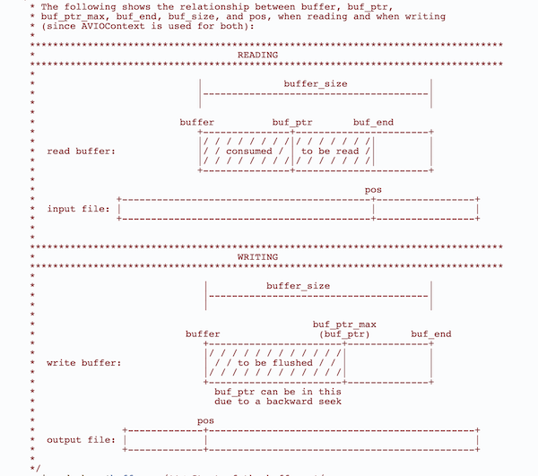

# AvIOContext

> 使用场景是: 使用 ffmpeg 相关解码代码要编译成 wasm 在浏览器端使用,js 层面拿到视频 buffer 数据(拉取的 m3u8 分片也好,本地上传的视频文件等等),将 buffer 传递给 c 解封装、解码,这时候就用到 AVIOContext

[AVIOContext](http://ffmpeg.org/doxygen/trunk/structAVIOContext.html)

> AVIOContext 主要使用逻辑: 我们有一块大的视频文件 buffer,然后 ffmpeg 对这块数据的访问借助于 io 上下文,io 上下文上自己维护了一个小的 buffer(注意:`这个小的buffer也是需要我们手动给io上下文分配`),之后 ffmpeg 内部解封转、解码需要的数据都从`io上下文这个小buffer`要, io 上下文上这个小 buffer 数据不足时又自己从我们的视频大 buffer 中不断补充数据

### 先看此上下文结构体中一些重要的属性:

```c
AVIOContext *avioCtx;

avioCtx->buffer // 即io上下文中那个小buffer,通过avio_alloc_context()来分配io上下文时作为参数传递

avioCtx->buffer_size // 小buffer的大小
avioCtx->buf_ptr // io上下文的小buffer中的数据当前被消耗的位置
avioCtx->buf_end // io上下文的小buffer数据的结束位置
avioCtx->opaque  // ** 是一个自定义的结构体,存储视频大buffer的信息,如buffer开始位置,视频buffer长度,这个结构会回传给 read_packet、write_packet、seek回调函数！！！ **,
avioCtx->read_packet  // 需要自己实现的一个 `用视频大buffer数据` 填充 `io上下文小buffer`的回调函数
avioCtx->write_packet //自己实现 把io上下文中的小buffer数据写到某处的回调函数
avioCtx->seek // 也是自己实现的 用来在视频大buffer中seek的函数

几个回调函数使用见后面介绍

```

avio.h 中关于 io 上下文 buffer 主要概念的图示:



### avio_alloc_context()

方法签名:

```c
AVIOContext *avio_alloc_context(
                  unsigned char *buffer,
                  int buffer_size,
                  int write_flag,
                  void *opaque,
                  int (*read_packet)(void *opaque, uint8_t *buf, int buf_size),
                  int (*write_packet)(void *opaque, uint8_t *buf, int buf_size),
                  int64_t (*seek)(void *opaque, int64_t offset, int whence));

```

这几个参数分别对应了上面结构体介绍中的对应属性,看实际使用流程:

### io 上下文使用流程

1. 定义一个结构体,存储视频大 buffer 数据相关信息

```c
typedef struct _BufferData
{
  uint8_t *ptr; // 指向buffer数据中 `还没被io上下文消耗的位置`
  uint8_t *ori_ptr; // 也是指向buffer数据的指针,之所以定义ori_ptr,是用在自定义seek函数中
  size_t size; // 视频buffer还没被消耗部分的大小,随着不断消耗,越来越小
  size_t file_size; //原始视频buffer的大小,也是用在自定义seek函数中
} BufferData;

// 拿到视频buffer数据及长度 定义bd 存储相关信息
BufferData bd;
bd.ptr = buffer
bd.ori_ptr = buffer
bd.size =xxxx
bd.file_size=xxxx

```

2. 分配 io 上下文使用的小 buffer

```c
#define IO_CTX_BUFFER_SIZE 4096 * 4;
uint8_t *ioCtxBuffer = av_malloc(IO_CTX_BUFFER_SIZE);

```

3. 自定义 read_packet() 、seek()方法 (自定义 seek 方法下面 seek 部分介绍)

```c
static int read_packet(void *opaque, uint8_t *buf, int buf_size)
{
  BufferData *bd = (BufferData *)opaque;
  buf_size = MIN(bd->size, buf_size);

  if (!buf_size)
  {
    printf("no buf_size pass to read_packet,%d,%d\n", buf_size, bd->size);
    return -1;
  }
  printf("ptr in file:%p io.buffer ptr:%p, size:%ld,buf_size:%ld\n", bd->ptr, buf, bd->size, buf_size);
  memcpy(buf, bd->ptr, buf_size);
  bd->ptr += buf_size;
  bd->size -= buf_size; // left size in buffer
  return buf_size;
}
```

> 主要实现功能就是从视频 buffer 某个位置开始,copy 一段数据到 io 上下文小 buffer

参数介绍:

opaque: 指向 自定义 BufferData 结构体的实例,因为要从视频 buffer 数据中不断通过 read_packet 读数据到 io 上下文小 buffer。

buf: io 上下文小 buffer 的开始位置,也就是上面定义的`ioCtxBuffer`,这个位置一直不变,`小buffer的数据不断被覆盖`

buf_size: 就是 io 上下文小 buffer 的大小,如上定义的`IO_CTX_BUFFER_SIZE`

4. 分配 io 上下文

```c
AVIOContext *avioCtx;
avioCtx = avio_alloc_context(ioCtxBuffer, IO_CTX_BUFFER_SIZE, 0, &bd, &read_packet, NULL,NULL);
```

5. 创建 AVFormatContext,并挂载 io 上下文

```c
AVFormatContext *fmtCtx = avformat_alloc_context();
fmtCtx.pb = avioCtx
fmtCtx->flags |= AVFMT_FLAG_CUSTOM_IO;
```

至此,就通过自定义 io 上下文,让 AVFormatContext 可以解封装提供的视频 buffer 数据了,之后的解封装、解码流程和不使用 io 上下文一样

# seek

> seek 功能研究卡住了几天,原因有二,1: AVIOContext 自定义 seek 函数的实现逻辑不清楚, 2: 对 ts 格式文件 精准 seek 存在花屏或解码失败问题,原以为自己实现逻辑存在问题,实际上对于 ts 格式,没有像 mp4 一样有地方存储所有关键帧的位置偏移信息,ffmpeg 也无能为力

ffmpeg 中 seek 功能通过 av_seek_frame()方法来进行

```c
/**
 * Seek to the keyframe at timestamp.
 * 'timestamp' in 'stream_index'.
 *
 * @param s media file handle
 * @param stream_index If stream_index is (-1), a default
 * stream is selected, and timestamp is automatically converted
 * from AV_TIME_BASE units to the stream specific time_base.
 * @param timestamp Timestamp in AVStream.time_base units
 *        or, if no stream is specified, in AV_TIME_BASE units.
 * @param flags flags which select direction and seeking mode
 * @return >= 0 on success
 */
int av_seek_frame(AVFormatContext *s, int stream_index, int64_t timestamp,
                  int flags);

                  /**
 * Seek to timestamp ts.
 * Seeking will be done so that the point from which all active streams
 * can be presented successfully will be closest to ts and within min/max_ts.
 * Active streams are all streams that have AVStream.discard < AVDISCARD_ALL.
 *
 * If flags contain AVSEEK_FLAG_BYTE, then all timestamps are in bytes and
 * are the file position (this may not be supported by all demuxers).
 * If flags contain AVSEEK_FLAG_FRAME, then all timestamps are in frames
 * in the stream with stream_index (this may not be supported by all demuxers).
 * Otherwise all timestamps are in units of the stream selected by stream_index
 * or if stream_index is -1, in AV_TIME_BASE units.
 * If flags contain AVSEEK_FLAG_ANY, then non-keyframes are treated as
 * keyframes (this may not be supported by all demuxers).
 * If flags contain AVSEEK_FLAG_BACKWARD, it is ignored.
```

#### AVIOContext 自定义 seek 函数

> io 上下文 seek 函数的主要逻辑是: 原始视频大 buffer 和长度知道,通过 seek 方法来把大 buffer 的要读取位置指定到某个位置

回调签名:

```c
int64_t(* 	seek )(void *opaque, int64_t offset, int whence)
```

参数介绍:

opaque: 同 read_packet 回调,原始视频 buffer 信息的结构体

offset: 要 seek 到的位置,可以是相对原始视频的起始位置,可以是相对 io 上下文小 buffer 的起始位置,取决于 whence

whence: seek 的类型,取值为 AVSEEK_SIZE 、SEEK_CUR 、SEEK_SET、SEEK_END,

AVSEEK_SIZE: 不进行 seek 操作,而是要求返回 视频 buffer 的长度大小

SEEK_CUR: 表示 offset 是相对 io 上下文小 buffer 开始位置的

SEEK_SET: 表示 offset 是相对 原始 buffer 开始位置的

SEEK_END: 表示 offset 是相对 原始 buffer 结束位置的

`通过 debug av_seek_frame --> seek_frame_internal ---> seek_frame_byte --->avio_seek() 发现对 iocontext 自定义的 seek 方法是在 avio_seek() 中使用的。发现 avio_seek 中调用 ioContext->seek()时 whence 只会传递 AVSEEK_SIZE 或 SEEK_SET`

所以自定义 io seek 函数实现如下即可:

```c
static int64_t seek_in_buffer(void *opaque, int64_t offset, int whence)
{
  BufferData *bd = (BufferData *)opaque;
  int64_t ret = -1;

  // printf("whence=%d , offset=%lld , file_size=%ld\n", whence, offset, bd->file_size);
  switch (whence)
  {
  case AVSEEK_SIZE:
    ret = bd->file_size;
    break;
  case SEEK_SET:
    bd->ptr = bd->ori_ptr + offset;
    bd->size = bd->file_size - offset;
    ret = bd->ptr;
    break;
  }
  return ret;
}
```

#### 精准 seek

av_seek_frame 要想不花屏需要设置 flag `AVSEEK_FLAG_BACKWARD`

对于 mp4 格式没毛病,seek 到里指定 pts 之前最近的关键帧,然后开始解码,从关键帧到指定的 pts 之前的视频帧可以手动丢弃,然后从指定 pts 位置开始展示

对于 ts 格式效果就没那么好,av_seek_frame() 对 ts 是会精确的 seek 到指定的 pts 位置的,但找不到 pts 之前最近的关键帧,指定 AVSEEK_FLAG_BACKWARD 也不行,效果就是: 从指定的 pts 位置开始解码,花屏直到遇到下一个关键帧,对于单个 ts 分片,只在开头有一个关键帧的这种,seek 后可能从指定的 pts 位置开始直接全部解码失败了。测试对一个 ts 文件 通过 ffplay `ffplay -ss 秒数 -i filepath` 进行 seek 播放,要么只有声音播放没有画面、要么先花屏一会。所以一般的 hls ts seek 操作都是不精准 seek,跨分片的。

最后,av_seek_frame()后需要刷新解码器上下文

```c
avcodec_flush_buffers(audioState.codecCtx);
avcodec_flush_buffers(videoState.codecCtx);

```
